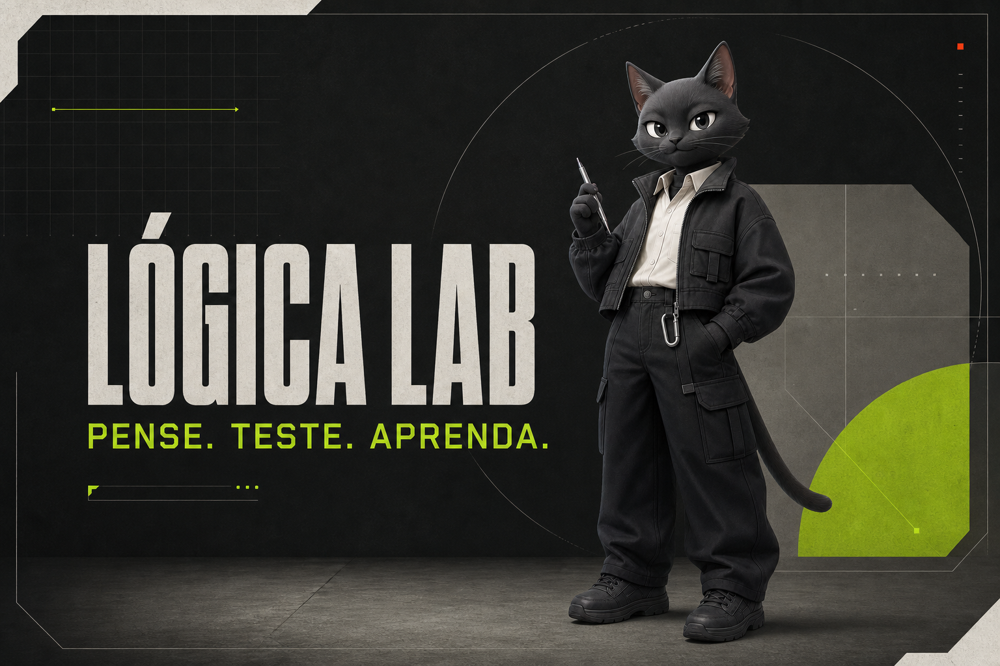

# Lógica Lab



Tutor interativo em português para aprender **lógica de programação antes de decorar sintaxe**. O projeto apresenta desafios curtos, exemplos relacionados, dicas graduais e testes automáticos em diferentes linguagens.

## Demonstração

Acesse a versão pública:

**[logica-tutor-programacao.renancotrin.chatgpt.site](https://logica-tutor-programacao.renancotrin.chatgpt.site)**

## Proposta

Muitas plataformas ensinam comandos de uma linguagem, mas deixam o raciocínio em segundo plano. O Lógica Lab parte de três perguntas:

1. Qual informação entra?
2. O que precisa acontecer com ela?
3. Qual resultado deve sair?

Depois de entender esses passos, o estudante pode expressar a mesma solução em linguagens diferentes.

## Funcionalidades

- Trilha de exercícios para iniciantes.
- Mapa visual da lógica de cada desafio.
- Exemplos semelhantes que não entregam imediatamente a resposta.
- Editor de código integrado.
- Testes automáticos com valores esperados e recebidos.
- Dicas graduais.
- Tutor contextual representado pelo mascote **Nó**.
- Explicações sobre exemplo, exercício, função, retorno e testes.
- Análise da tentativa escrita no editor.
- Progresso salvo localmente no navegador.
- Interface responsiva para computador e celular.
- Identidade visual monocromática e industrial.

## Linguagens e tecnologias praticadas

| Opção | Uso no projeto |
| --- | --- |
| Lógica pura | Escrever algoritmos em pseudocódigo |
| Python | Executar soluções com Pyodide |
| JavaScript | Executar funções em Web Workers |
| TypeScript | Praticar lógica com tipos básicos |
| Java | Praticar métodos, condições e repetições |
| SQL | Representar consultas e transformações de dados |
| HTML | Estruturar visualmente os passos de uma solução |
| CSS | Representar e organizar estados visuais |
| Markdown | Documentar o raciocínio de um algoritmo |

Python, JavaScript, TypeScript, Java e pseudocódigo possuem verificação executável. SQL, HTML, CSS e Markdown recebem análise estrutural adequada ao papel de cada tecnologia.

## Como o tutor funciona

O tutor usa o contexto da tela para formular a orientação:

- exercício selecionado;
- linguagem atual;
- código presente no editor;
- resultado da última execução;
- intenção identificada na pergunta.

Ele diferencia dúvidas como:

- “Isso é um exemplo ou um teste?”
- “Onde devo escrever o cálculo?”
- “O que significa `FIM FUNÇÃO`?”
- “Por que não posso colocar um resultado fixo?”
- “Explique o meu código.”

Atualmente, essa orientação contextual funciona localmente e não exige uma chave de API ou serviço externo de inteligência artificial.

## Tecnologias do projeto

- React 19
- Next.js 16
- TypeScript
- vinext
- Vite
- Cloudflare Workers
- Pyodide
- Node.js Test Runner

## Executando localmente

### Pré-requisitos

- Node.js `22.13.0` ou superior
- npm

### Instalação

```bash
git clone https://github.com/renancotrin-alt/logica-lab.git
cd logica-lab
npm install
npm run dev
```

Abra o endereço local informado pelo terminal.

### Validação

```bash
npm test
```

O comando gera a versão de produção e executa os testes do HTML renderizado e do tutor contextual.

## Comandos disponíveis

| Comando | Descrição |
| --- | --- |
| `npm run dev` | Inicia o ambiente de desenvolvimento |
| `npm run build` | Gera a versão de produção |
| `npm run start` | Executa a versão gerada |
| `npm test` | Gera o projeto e executa os testes |
| `npm run lint` | Verifica a qualidade do código |

## Estrutura principal

```text
logica-lab/
├── app/
│   ├── globals.css       # Identidade visual e responsividade
│   ├── layout.tsx        # Metadados e estrutura global
│   └── page.tsx          # Exercícios, editor, testes e tutor
├── public/
│   ├── no-mascot-v1.png # Mascote Nó
│   └── og-v3.png         # Imagem de compartilhamento
├── tests/
│   └── rendered-html.test.mjs
├── worker/
├── package.json
└── vite.config.ts
```

## Próximos passos

- Adicionar novos níveis de dificuldade.
- Criar mais exercícios de condições, repetições, listas e funções.
- Permitir trilhas personalizadas.
- Integrar opcionalmente uma LLM para conversas mais abertas.
- Criar contas e sincronização de progresso entre dispositivos.
- Adicionar testes de interface.

## Autor

Projeto criado por [Renan Cotrin](https://github.com/renancotrin-alt).
